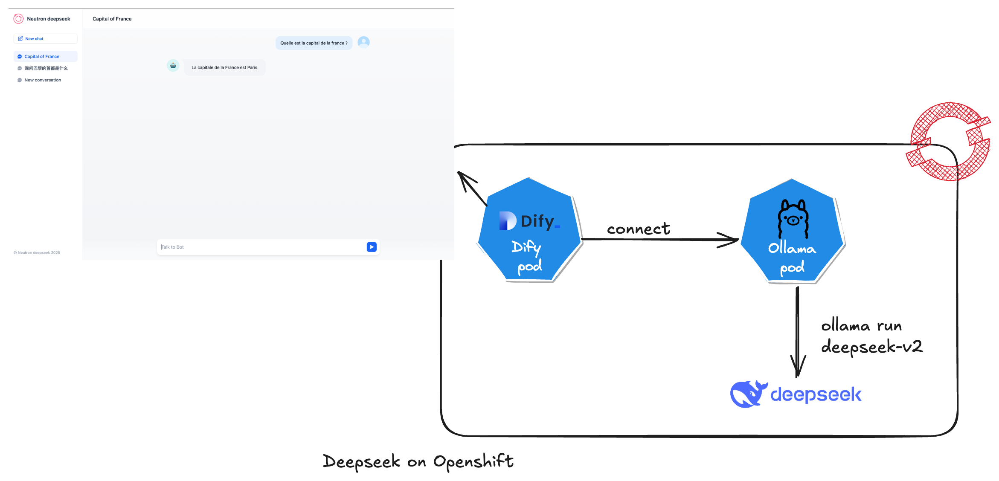
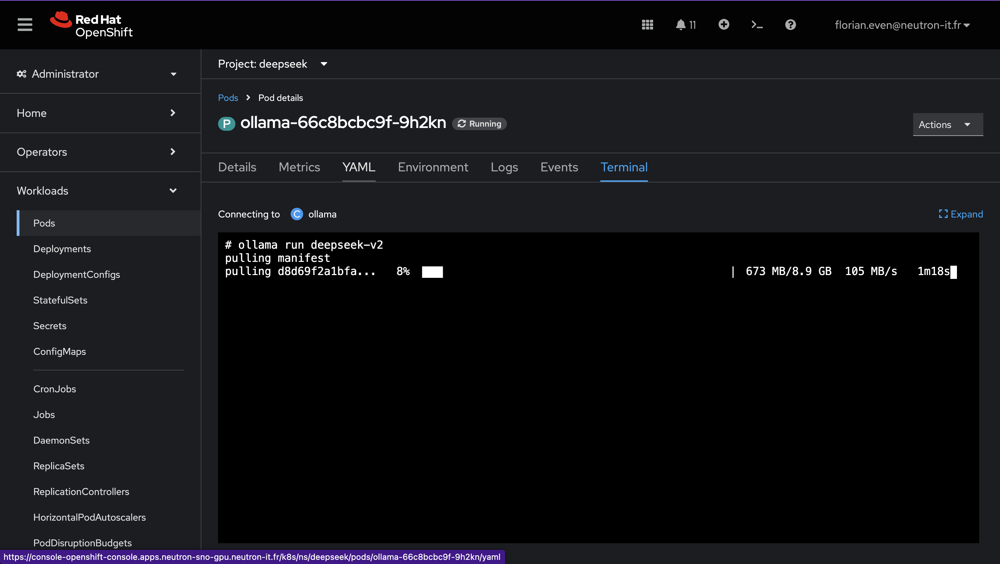
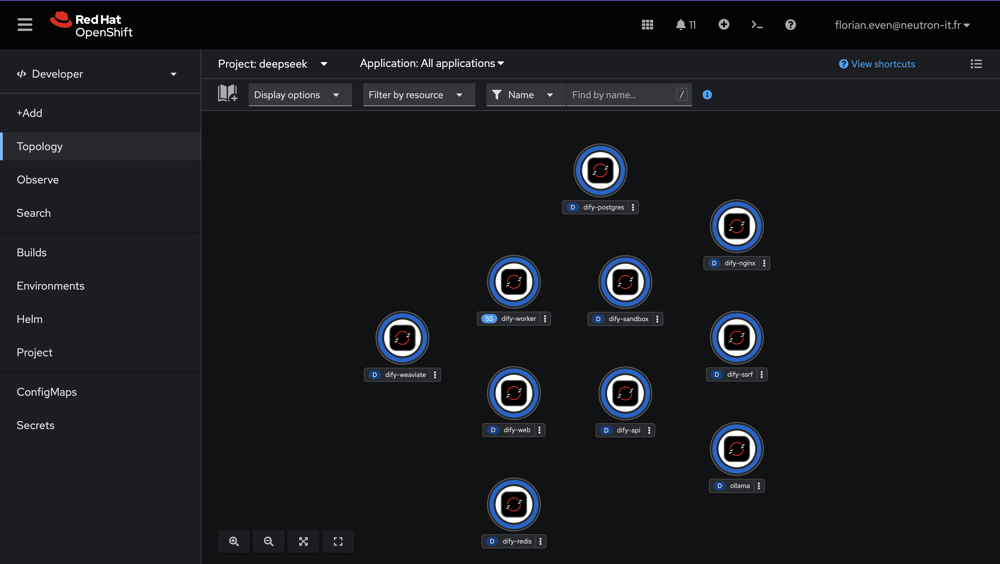
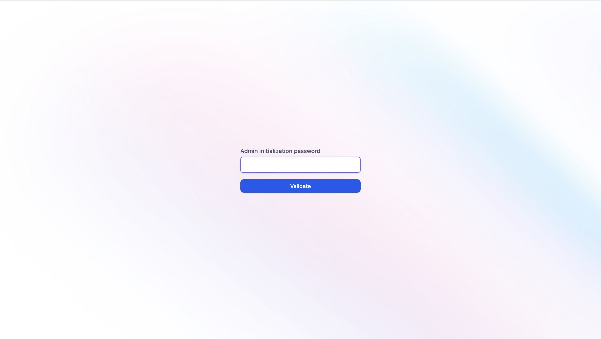
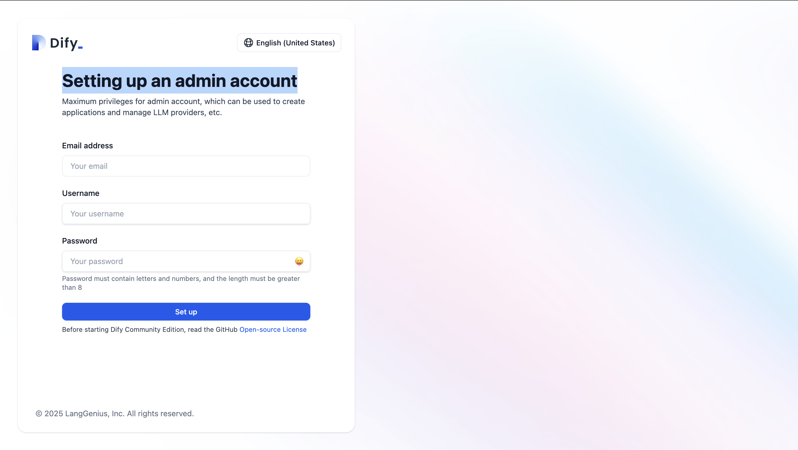
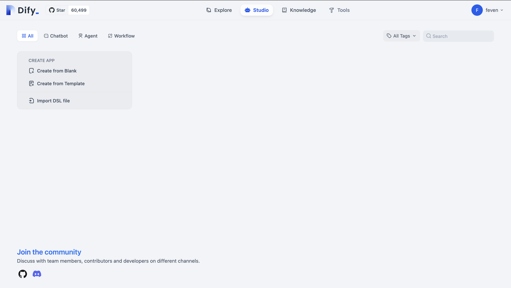
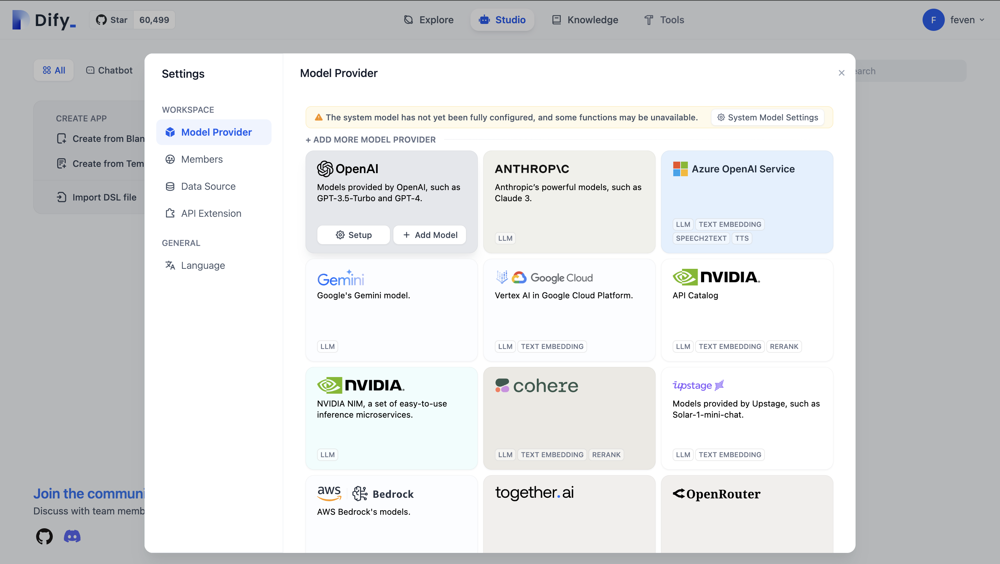
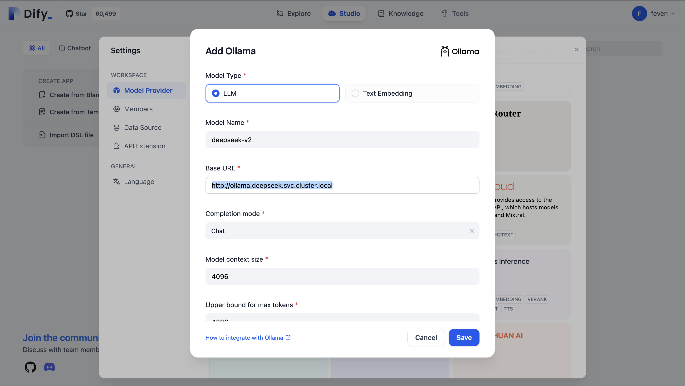
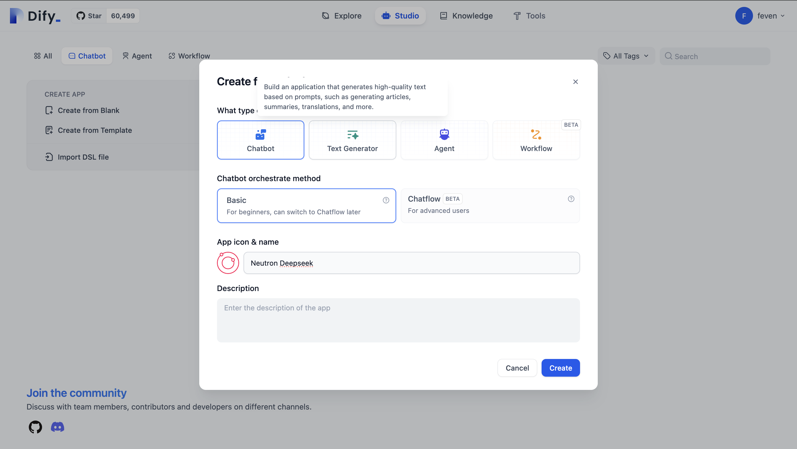
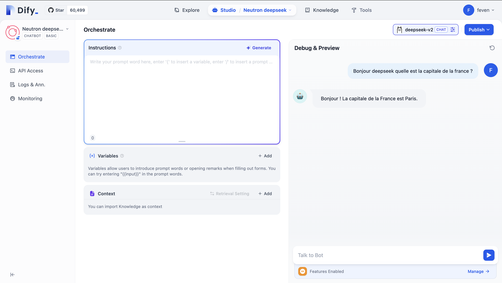

# Déploiement de DeepSeek sur OpenShift



## Prérequis

Avant de commencer, assurez-vous de remplir les conditions suivantes :

- Être en mesure de se connecter à un cluster OpenShift.
- Pouvoir créer un namespace sur OpenShift.
- Avoir les privilèges administrateur sur ce namespace.
- Cloner le dépôt suivant pour disposer des fichiers nécessaires :

  ```bash
  git clone https://github.com/neutron-IT-organization/deepseek-openshift.git
  ```

## 1. Créer un Namespace deepseek

Pour commencer, créez un namespace dédié à DeepSeek sur OpenShift :

```bash
oc create namespace deepseek
```

## 2. Ajouter la SCC `privileged` au service account `default`

Ensuite, attribuez la SCC (Security Context Constraint) `privileged` au service account `default` dans le namespace `deepseek` :

```bash
oc adm policy add-scc-to-user privileged -z default -n deepseek
oc adm policy add-scc-to-user privileged -z dify-redis -n deepseek
oc adm policy add-scc-to-user privileged -z dify-postgres -n deepseek
oc adm policy add-scc-to-user privileged -z dify-weaviate -n deepseek
```

## 3. Installer le déploiement d'Ollama


Déployez le manifest manifest/ollama.yaml dans le namespace `deepseek` avec le fichier de configuration suivant :

```yaml
apiVersion: apps/v1
kind: Deployment
metadata:
  name: ollama
  namespace: deepseek
spec:
  replicas: 1
  selector:
    matchLabels:
      app: ollama
  template:
    metadata:
      labels:
        app: ollama
    spec:
      securityContext:
        runAsUser: 0
      containers:
        - name: ollama
          image: ollama/ollama:latest
          ports:
            - containerPort: 11434
              protocol: TCP
          resources: {}
      restartPolicy: Always
      terminationGracePeriodSeconds: 30
      dnsPolicy: ClusterFirst
```

Appliquez cette configuration avec la commande suivante :

```bash
oc apply -f manifest/ollama.yaml
```

## 4. Exécuter deepseek-v2 dans ollama


Accédez à l'onglet Workloads > Pods.

Recherchez le pod ollama dans le namespace deepseek.

Cliquez dessus, puis allez dans l'onglet Terminal.

Exécutez la commande suivante directement dans le terminal du pod :

Une fois le déploiement d'Ollama effectué, exécutez la commande suivante à l'intérieur du pod pour lancer `deepseek-v2` :

```shell
ollama run deepseek-v2
```



#### Alternative en ligne de commande

```bash
oc exec -it <pod-name> -- ollama run deepseek-v2
```

Remplacez `<pod-name>` par le nom du pod Ollama que vous pouvez obtenir avec la commande `oc get pods`.

## 5. Installer Dify dans le namespace `deepseek`

Ajoutez le repo Helm de Dify et installez-le dans le namespace `deepseek` :

```bash
oc apply -f manifest/dify.yaml
```



## 6. Exposer Dify avec une Route

Enfin, exposez le service Dify via une route OpenShift pour rendre l'application accessible :

```yaml
kind: Route
apiVersion: route.openshift.io/v1
metadata:
  name: dify-route
  namespace: deepseek
spec:
  path: /
  to:
    kind: Service
    name: dify-nginx
    weight: 100
  port:
    targetPort: dify-nginx
  tls:
    termination: edge
  wildcardPolicy: None
```

Appliquez cette route avec la commande suivante :

```bash
oc apply -f manifest/dify-route.yaml
```

Vous pouvez maintenant accéder a dify via la route. Pour la récupérer utilisez la commande ci dessous 

```shell
oc get route dify-route -n deepseek -o jsonpath='{.spec.host}'
```

## 7. Configuration de dify

Lors de la premiere connextion a dify, le mot de passe administrateur vous sera demandé. Par défaut celui-ci prend la valeur ```password```.



Complétez ensuite le formulaire ```Setting up an admin account``` avec un user/password.



Vous devriez maintenant accéder a l'interface Dify.



## 8. Create Deepseek chatbot

Dans un premier temps configurez le model deepseek. Pour cela cliquez sur votre nom en haut a droite puis sur Settings. Puis cliquez sur Model Provider.



Selectionnez ensuite Ollama et cliquez sur ```+ Add Model```

Complétez le formulaire.

Dans Model Name, indiquez le nom de votre model. Ici ```deepseek-v2```. Dans Base URL ecrivez le nom du service ollama ```http://ollama.deepseek.svc.cluster.local```.



NOTE: Rechargez ensuite votre page pour que le model soit bien pris en compte. Pour cela vous pouvez cliquez sur F5.


Vous pouvez maintenant créer votre chatbot. Pour cela dans l'onglet Studio, cliquez sur Chatbot puis sur ```+ Create from blank```.

Donnez un nom a votre chatbot puis cliquez sur create.



Votre chatbot est des a present fonctionnel vous pouvez le tester en discantant dans la section ```Talk to bot```.




## 9. Publier Deepseek chatbot

Vous pouvez maintenant publier votre chatbot.

Pour cela cliquez sur Publish. Penser a ```update``` votre chatbot. Cliquez sur Run App. 

NOTE: Selon la configuration de votre nginx, il est possible que l'url utilisé soit dify-api:5001. Si c'est le cas remplacer dans l'url dify-api:5001 par votre route pour accéder au chatbot.


## Conclusion

Vous avez maintenant déployé DeepSeek sur OpenShift. Vous pouvez accéder à l'application via la route exposée et utiliser les différents services qu'elle offre.

